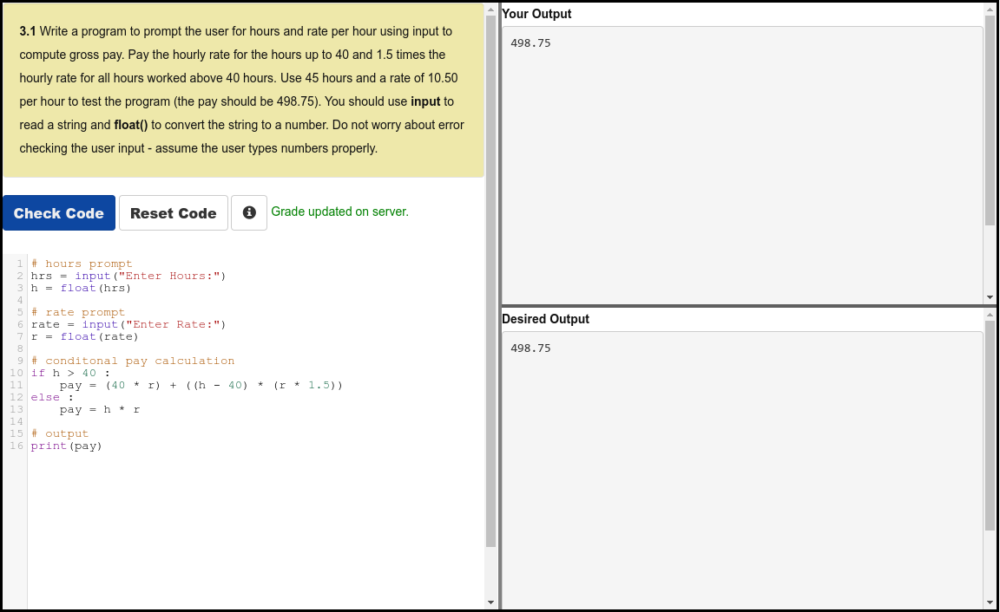
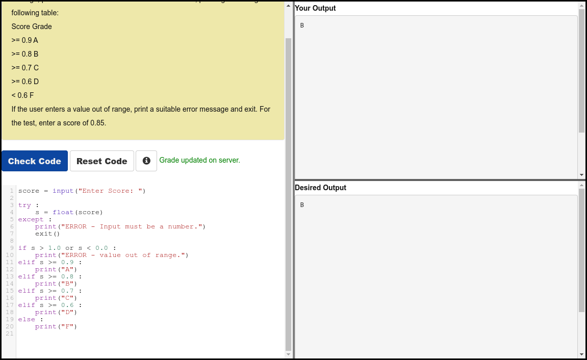
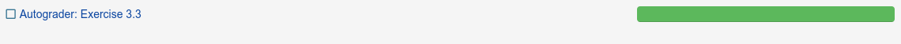

# Python 4 Everyone

## 03 Conditional Execution

### Videos

- [Conditional Execution - Part 1](https://youtu.be/2aA3VBdcl6A)
- [Conditional Execution - Part 2](https://youtu.be/OczkNrHPBps)
- [Worked Exercise: 3.1](https://youtu.be/oUMQbZ4SBuM)
- [Worked Exercise: 3.2](https://youtu.be/-iUA4cCKRlM)

### Slides

- [Powerpoint](../Resources/Pythonlearn-03-Conditional.pptx)

### References

- [www.py4e.com](https://www.py4e.com/html3/03-conditional)

### Assignments

#### Autograder 3.1

#### Autograder 3.3

<table>
<tr>
<td style="vertical-align:top;">

 

**BRIEF:** Write a program to prompt for a score between 0.0 and 1.0. If the score is out of range, print an error. If the score is between 0.0 and 1.0, print a grade using the table opposite.

If the user enters a value out of range, print a suitable error message and exit. For the test, enter a score of 0.85

</td>
<td width="200">

| Student Score  | Student Grade |
| :---:  | :---: |
| >= 0.9 | A     |
| >= 0.8 | B     |
| >= 0.7 | C     |
| >= 0.6 | D     |
| < 0.6  | F     |

</td>
</tr>
</table>

#### Quiz

