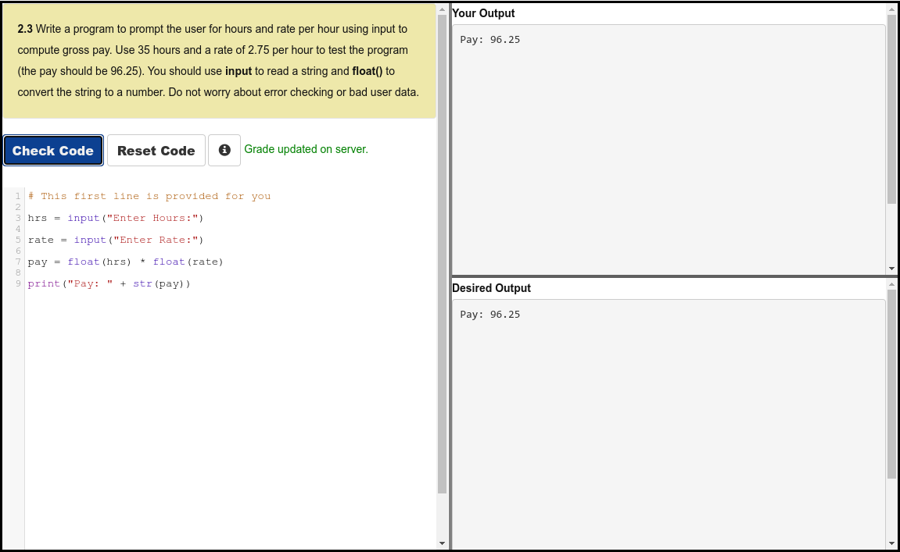
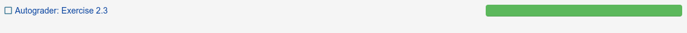

# Python 4 Everyone

## 03 Variables Expressions and Statements

### Videos

- [Variables Expressions and Statements - Part 1](https://youtu.be/7KHdV6FSpo8)
- [Variables Expressions and Statements - Part 2](https://youtu.be/kefrGMAglGs)
- [What happens when the CPU cooler is removed?](https://youtu.be/FG86hIkxWUQ)
- [Worked Exercise: 2.2](https://youtu.be/_b-nVJrl02M)
- [Worked Exercise: 2.3](https://youtu.be/DVmspDooG2c)

### Slides

- [Powerpoint](../../Resources/Pythonlearn-02-Expressions.pptx)
- [www.py4e.com](https://www.py4e.com/html3/02-variables)

### Assignments

#### Autograder

#### Quiz

