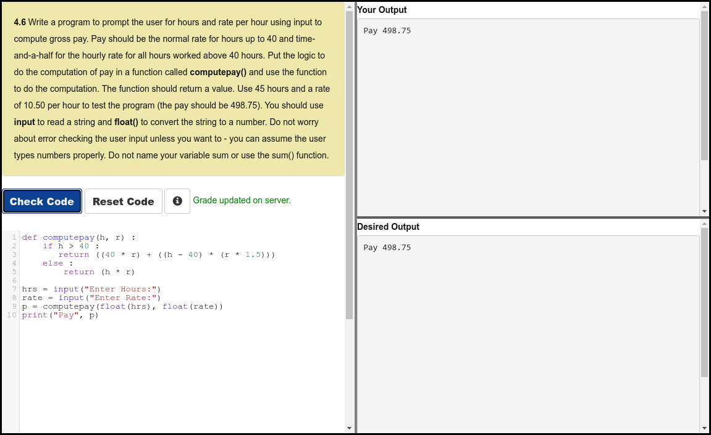

# Python 4 Everyone

## 04 - Functions

### Videos

- [Functions - Part 1](https://youtu.be/5Kzw-0-DQAk)
- [Functions - Part 2](https://youtu.be/AJVNYRqn8kM)
- [Worked Exercise: 4.6](https://youtu.be/l93PhBUJ_S0)

### Slides

- [Powerpoint](../Resources/Pythonlearn-04-Functions.pptx)

### References

- [www.py4e.com](https://www.py4e.com/html3/04-functions)

### Assignments

#### Autograder 4.6

#### Quiz

