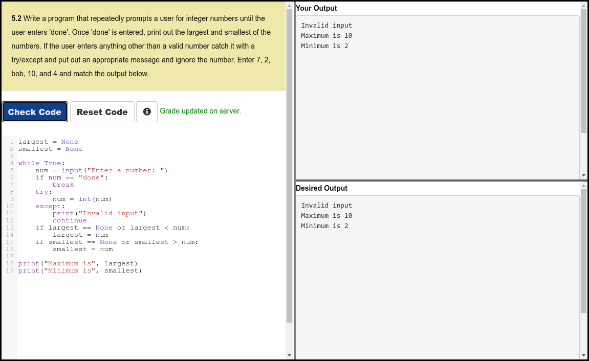

# Python 4 Everyone

## 05 - Loops and Iterations

### Videos

- [Loops and Iterations - Part 1](https://youtu.be/FzpurxjwmsM)
- [Loops and Iterations - Part 2](https://youtu.be/5QDrj5ogPYc)
- [Loops and Iterations - Part 3](https://youtu.be/xsavQp8hd78)
- [Loops and Iterations - Part 4](https://youtu.be/yjlMMwf9Y5I)
- [Worked Exercise: 5.1](https://youtu.be/R2GrfqRofZc)

### Slides

- [Powerpoint](../Resources/Pythonlearn-04-Functions.pptx)
- [www.py4e.com](https://www.py4e.com/html3/05-iterations)

### Assignments

#### Autograder 5.2

#### Quiz

