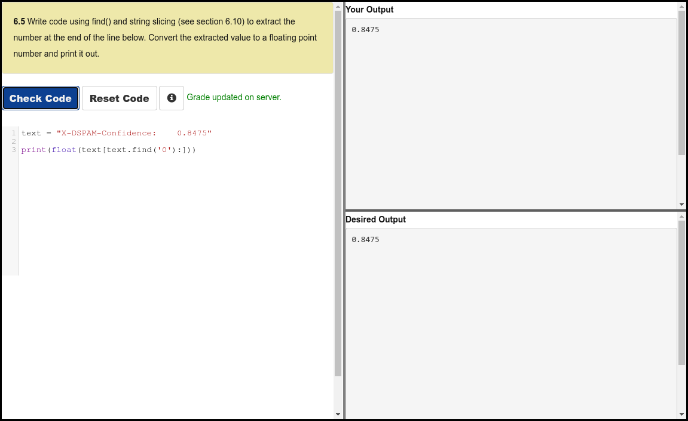

# Python 4 Everyone

## 06 - Strings

### Videos

- [Loops and Iterations - Part 1](https://youtu.be/dr98iM4app8)
- [Loops and Iterations - Part 2](https://youtu.be/bIFpJ-qZ3Cc)
- [Worked Exercise: 6.5](https://youtu.be/BGTxwsDI9KY)

### Slides

- [Powerpoint](../Resources/Pythonlearn-06-Strings.pptx)

### References

- [www.py4e.com](https://www.py4e.com/html3/06-strings)

### Assignments

#### Autograder 6.5

#### Quiz

