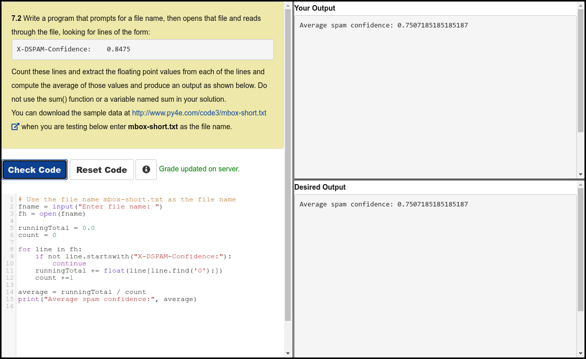

# Python 4 Everyone

## 07 - Files

### Videos

- [Files - Part 1](https://youtu.be/9KJ-XeQ6ZlI)
- [Files - Part 2](https://youtu.be/0t4rvnySKR4)
- [Worked Exercise: 7.1](https://youtu.be/MHZ4KnFZ7Y0)

### Slides

- [Powerpoint](../Resources/Pythonlearn-07-Files.pptx)

### References

- [www.py4e.com](https://www.py4e.com/html3/07-files)

### Assignments

#### Autograder 7.2

#### Quiz

<!--  -->

