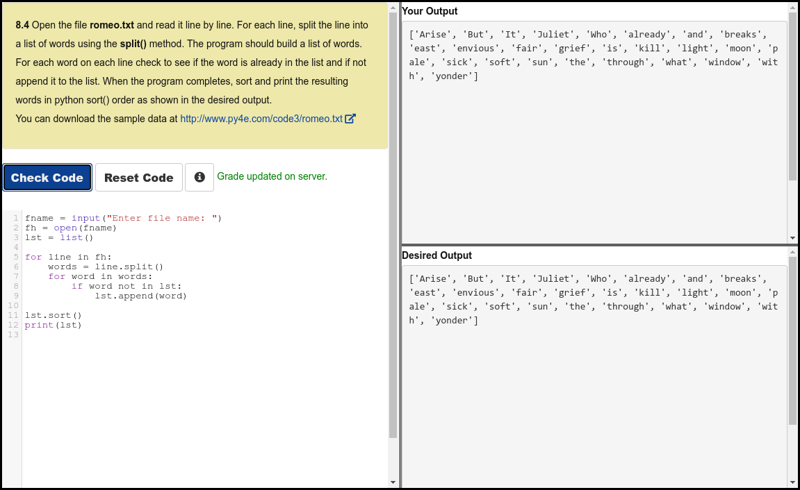
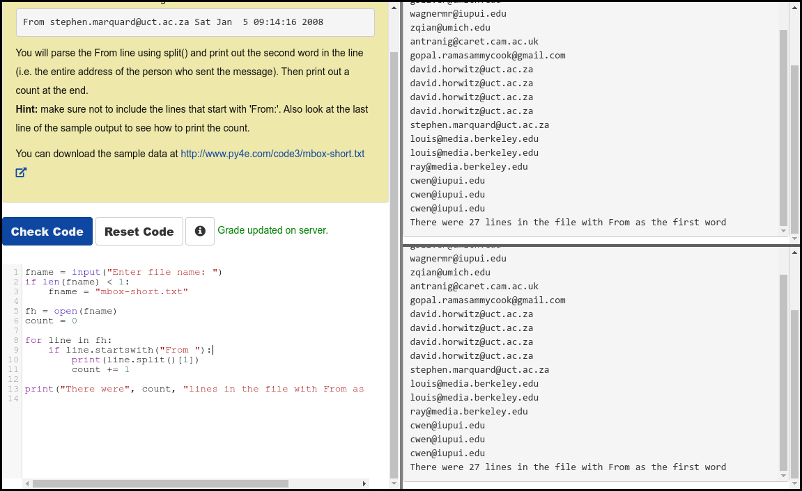

# Python 4 Everyone

## 08 - Lists

### Videos

- [Lists - Part 1](https://youtu.be/ljExWqnWQvo)
- [Lists - Part 2](https://youtu.be/bV1FQUBIApM)
- [Lists - Part 3](https://youtu.be/GxADdpo6EP4)
- [Lists, Files and the Guardian Pattern](https://youtu.be/WU6_0A9zYRA)

### Slides

- [Powerpoint](../Resources/Pythonlearn-08-Lists.pptx)

### References

- [www.py4e.com](https://www.py4e.com/html3/08-lists)

### Assignments

#### Autograder 8.4

#### Autograder 8.5

#### Quiz

