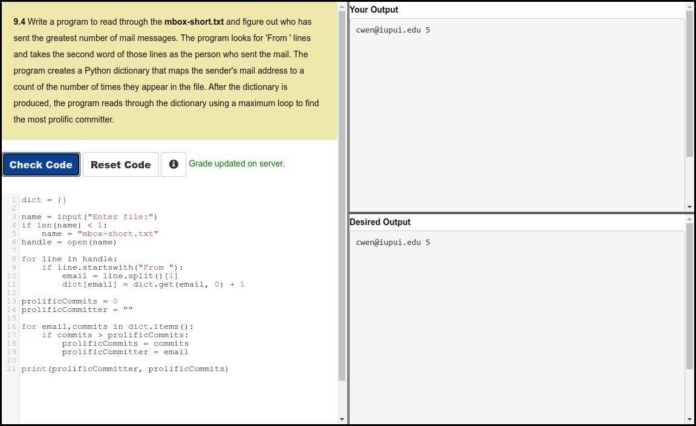

# Python 4 Everyone

## 09 - Dictionaries

- [Dictionaries - Part 1](https://youtu.be/yDDRMb-1cxI)
- [Dictionaries - Part 2](https://youtu.be/LRSIuH94XM4)
- [Dictionaries - Part 3](https://youtu.be/ZDjiFB1Ib84)
- [Counting Word Frequency using a Dictionary](https://youtu.be/lLbyEYjU55A)

### Slides

- [Powerpoint](../Resources/Pythonlearn-09-Dictionaries.pptx)

### References

- [www.py4e.com](https://www.py4e.com/html3/09-dictionaries)

### Assignments

#### Autograder 9.4

#### Quiz

