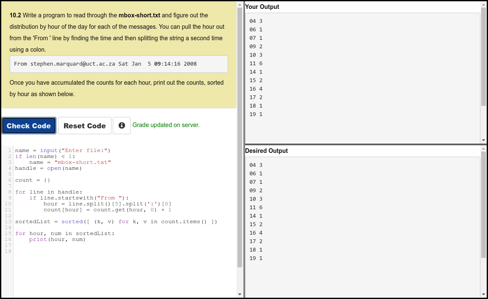

# Python 4 Everyone

## 10 - Tuples

- [Tuples - Part 1](https://youtu.be/CaVhM65wD6g)
- [Tuples - Part 2](https://youtu.be/FdUdA6o0Ij0)
- [Sorting a Dictionary Using Tuples](https://youtu.be/hMJpet-gtc0)

### Slides

- [Powerpoint](../Resources/Pythonlearn-10-Tuples.pptx)

### References

- [www.py4e.com](https://www.py4e.com/html3/10-tuples)

### Assignments

#### Autograder 10.2




**NOTE:** lines 13, 15 and 16 in the above could be consolidated as:

```python
for hour, num in sorted([ (hour, num) for hour, num in count.items() ]):
        print(hour, num)
```

However, this does not fit into the space provided by the autograder and, despite the current trend to minimise lines of code, any improvement to readability is questionable at best. I have included only for completeness sake as I thought it should be possible, and testing has proven this correct.


#### Quiz

<!--  -->

