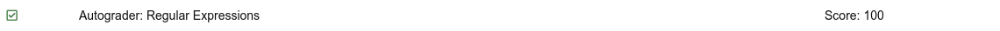
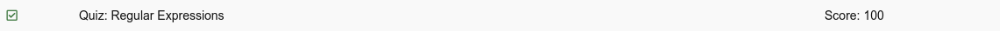

# Python 4 Everyone

## 11 - Regular Expressions

### Videos

- [Regular Expressions - Part 1](https://youtu.be/ovZsvN67Glc)
- [Regular Expressions - Part 2](https://youtu.be/fiar4QZZ7Xo)
- [Regular Expressions - Part 3](https://youtu.be/GiQdXo2Bvgc)

### Slides

- [Powerpoint](../Resources/Pythonlearn-11-Regex.pptx)

### References

- [www.py4e.com](https://www.py4e.com/html3/11-regex)
- [Regex Quick Guide](regex.md)

### Assignments

#### Autograder: Regular Expressions

<!-- 
 -->

#### Quiz

<!--  -->

