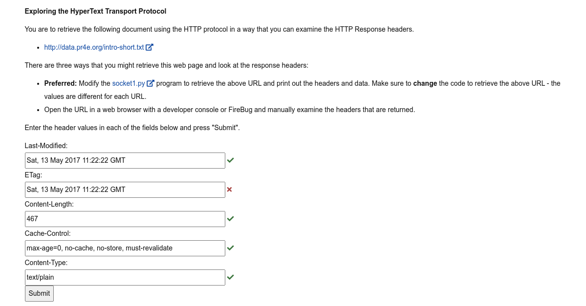
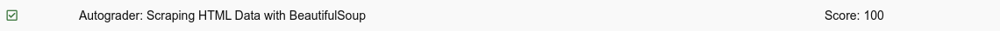
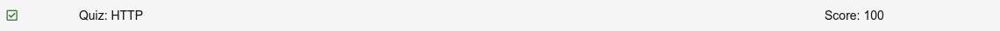

# Python 4 Everyone

## 12 - Network Programming

- [Network Programming - Part 1: Networks and Packets](https://youtu.be/RsnaRPC52G0)
- [Network Programming - Part 2: Servers and Protocols](https://youtu.be/Bvx7vY454xw)
- [Network Programming - Part 3: Using HTTP in Python](https://youtu.be/Lr9Vm-VghAk)
- [Worked Example: Sockets](https://youtu.be/EqUyu8ZZYUE)
- [Network Programming - Part 4: Characters, ASCII and Unicode](https://youtu.be/-cmlmaVSONg)
- [Network Programming - Part 5: Using urllib in Python](https://youtu.be/k1sUxGPpQOk)
- [Worked Example: Urllib](https://youtu.be/jKaCKIdIoks)
- [Network Programming - Part 6: Beautiful Soup](https://youtu.be/D7ZI8--qbBw)
- [Worked Example: BeautifulSoup](https://youtu.be/mhaHWiSPxxE)

### Slides

- [Powerpoint](../Resources/Pythonlearn-12-HTTP.pptx)

### References

- [www.py4e.com](https://www.py4e.com/html3/12-network)
- [ASCII coding and Binary](https://www.youtube.com/watch?v=H4l42nbYmrU&t=308s)
- [Characters, Symbols and the Unicode Miracle - Computerphile](https://www.youtube.com/watch?v=MijmeoH9LT4&t=385s)

### Assignments

#### Autograder: Request-Response Cycle



[soket1.py](socket1.py)

#### Autograder: Scraping HTML Data with BeautifulSoup

```python
import urllib.request, urllib.parse, urllib.error
from bs4 import BeautifulSoup

# get data
url = input("Enter URL: ")
html = urllib.request.urlopen(url).read()
soup = BeautifulSoup(html, "html.parser")

# Retrieve all of the span elements
tags = soup("span")

# sum contents of tags
total = 0
for tag in tags:
    total += int(tag.contents[0])

# output
print(total)
```


#### Autograder: Following Links with BeautifulSoup

```python
import urllib.request, urllib.parse, urllib.error
from bs4 import BeautifulSoup

# get data
url = input("Initial URL: ")
position = int(input("Link position: ")) - 1
repeat = int(input("Links in URL chain: ")) + 1

# loop through urls
for x in range(int(repeat)):
    html = urllib.request.urlopen(url).read()
    print("Retrieving:", url)
    soup = BeautifulSoup(html, "html.parser")
    url = soup('a')[position].get('href', None)
```


#### Quiz

<!--  -->