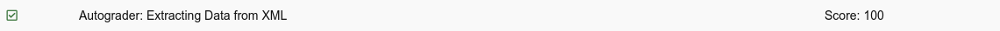

# Python 4 Everyone

## 13 - Web Services

- [Web Services - Part 1: XML](https://youtu.be/7NEtEctD9Cw)
- [Web Services - Part 2: XML](https://youtu.be/A8KcBx9153Y)
- [Worked Example: XML](https://youtu.be/7q8uUehNRK0)
- [Web Services - Part 3: XML Schema](https://youtu.be/0cA6W-4JPQ4)
- [Web Services - Part 4: JSON](https://youtu.be/J5DjteDzgoM)
- [Worked Example: JSON](https://youtu.be/RGQfDirZ7_s)
- [Discovering JSON - Douglas Crockford](https://youtu.be/kc8BAR7SHJI)
- [Web Services - Part 5: SOA](https://youtu.be/SNeJcvBY-h4)
- [The JISC e-Framework](https://youtu.be/mj-kCFzF0ME)
- [Web Services - Part 6: GeoJSON](https://youtu.be/QyHcOL3C7fQ)
- [Worked Example: GeoJSON](https://youtu.be/vjQZscHOaG4)
- [Web Services - Part 7: Twitter](https://youtu.be/mrRo2xX39nw)
- [Worked Example: Twitter](https://youtu.be/zJzPyEPCbXs)

### Slides

- [Powerpoint](../Resources/Pythonlearn-13-WebServices.pptx)

### References

- [www.py4e.com](https://www.py4e.com/html3/13-web)

### Assignments

#### Autograder: Extracting Data from XML

[Code file for autograder-xml.py](autograder-xml.py)

#### Quiz: XML

#### Autograder: Extract Data from JSON

[Code file for autograder-json.py](autograder-json.py)

#### Quiz: JSON

<!--  -->

#### Autograder: Using the GeoJSON API

<!-- 
 -->